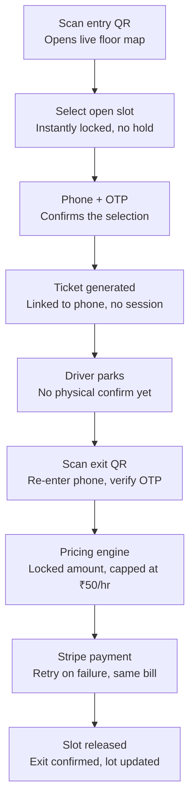

# Smart Park — Automated Parking Management System

Team Tech No Logical · Code2Create 7.0 (ACM-VIT)

## Problem

Urban parking in most Indian cities still depends on manual attendants, causing slow entry queues and long waits. Drivers have no visibility into slot availability, so they circle lots blindly, wasting fuel and time. Pricing stays fixed regardless of demand, so lots overflow during peak hours while owners lose revenue during quiet ones.

## Solution

Smart Park removes the need for manual attendants and app installs. A driver scans a QR code, picks an open slot on a live floor-by-floor dashboard, and gets billed automatically on exit through a second QR scan, no app download, no persistent login, no attendant.

The system is built on **two independent QR codes linked only by phone number**:

- **Entry QR** — opens the live slot-selection form
- **Exit QR** — re-verifies the driver and triggers billing

No session, cookie, or saved link is required between the two. The phone number is the only identity key connecting a car's entry to its exit.

## Complete Flow



## Pricing Logic

```
Rate = Base rate × Occupancy factor × Peak-hour factor
```

| Factor | Value |
|---|---|
| Base rate | ₹20 / hour |
| Occupancy < 50% | ×1.0 |
| Occupancy 50–80% | ×1.3 |
| Occupancy > 80% | ×1.6 |
| Peak hours (9–11 AM, 5–8 PM) | ×1.2 |
| **Hard ceiling** | **₹50 / hour, regardless of multipliers** |

The exit timestamp and bill amount are **locked the moment the exit QR is scanned**, not when payment completes. This means a failed or retried payment never changes the amount owed.

## Data Model (conceptual)

A single `tickets` record per active parking session, keyed by phone number:

| Field | Purpose |
|---|---|
| `phone` | Identity key linking entry and exit |
| `plateNumber` | Vehicle identification |
| `slotId` | Which slot is occupied |
| `entryTime` | Set at entry QR scan |
| `exitTime` | Set at exit QR scan (locked, not recalculated) |
| `amount` | Calculated once at exit, reused on payment retry |
| `status` | `active` → `billed` → `paid` |

Slot status stays `occupied` until the ticket status reaches `paid`.

## Tech Stack

- **Frontend:** HTML, CSS, JavaScript — no framework, no build step. Loaded directly from the QR scan.
- **Auth:** Firebase Phone Authentication for OTP verification.
- **Database:** Cloud Firestore for real-time slot occupancy and ticket state.
- **Payments:** Stripe API — bill locked at exit-scan time, retried on failure without recalculating the amount.

## Team

Tech No Logical — VIT Vellore, BTech CSE

